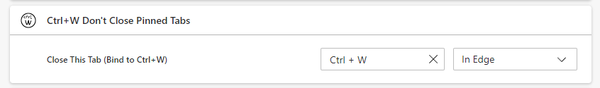

# Ctrl W Don't Close Pinned Tabs

This Chrome extension simulates Firefox's behavior on the hotkey Ctrl-W on a pinned tab; it does NOT close the tab.

## Usage

You need to *explicitly* bind the key to `ctrl+w` in "Keyboard Shortcuts" in chrome://extensions/ to use the functionality (as in the screenshot above). This is not possible to do automatically.

## Known issues

The extension can't close DevTools windows correctly (due to safety limitations in the tabs API); see [this issue](https://github.com/EtaoinWu/smart-ctrl-w/issues/2). This **will not** be fixed.
